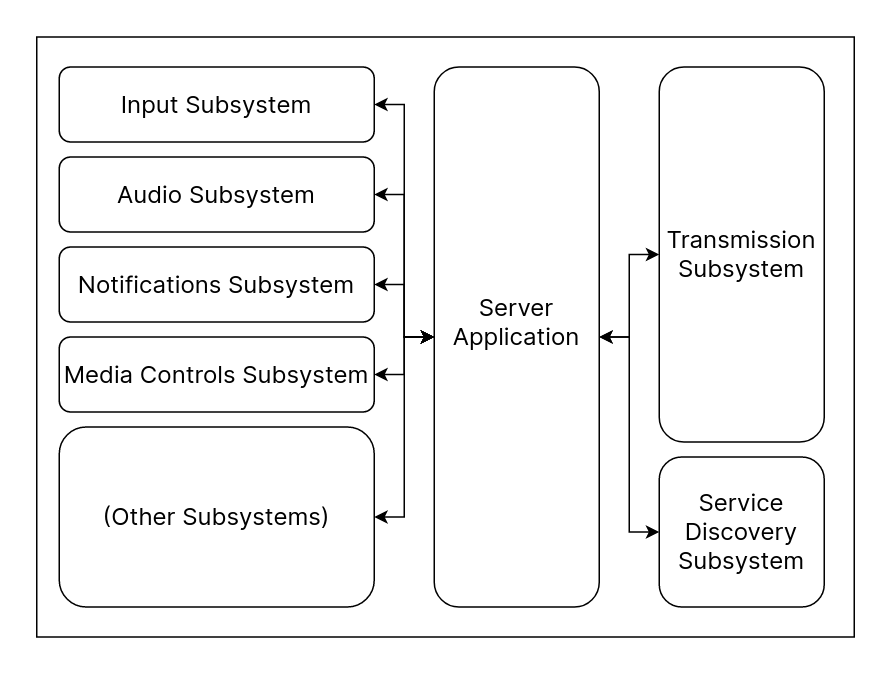

# Server System Design

This is the system design for the server.

The Server consists of multiple parts (called subsystems), each of which has a unique purpose. More subsystems can be added to provide even more functionality.

The reference implementation of the server is written in [Go](https://go.dev), which can be found [here](https://github.com/CrosineEnterprises/cyprus) [**NOTE:** NOT MADE PUBLIC].

From the above, the Server Application manages all the other subsystems, *though the Transmission Subsystem is always alive when the server is running*.

## Subsystems

### Transmission Subsystem

This subsystem is responsible for all communications between the server and client.

Even though there can be multiple implementations of the transmission subsystem, the only one which is complete is the fallback `WebSockets`-based one.

1. [**Transmission Subsystem (WebSocket)**](./subsystems/transmission-websockets.md)

### [Service Disovery Subsystem](./subsystems/service-discovery.md)

This subsystem advertises the server over the local network so that the client can automatially find and connect to the same.

### [Media Player Subsystem](./subsystems/media-player.md)

This subsystem manages and operates media player signals, properties and methods, and communicates to the transmission subsystem, and by proxy, to any devices connected to the server.
